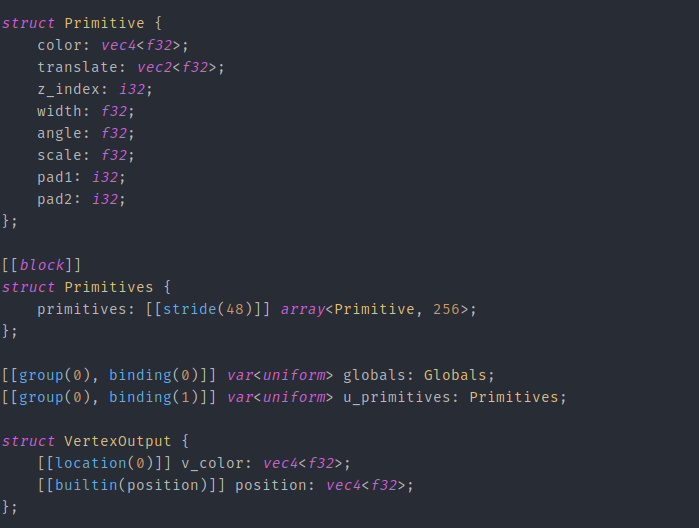
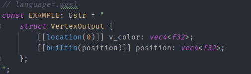

<h1 align="center"> wgsl-intellij-syntax</h1>

  <strong>Syntax highlighting for WGSL files in IntelliJ</strong>

  A highlighter using TextMate

  

## Description

This is a TextMate bundle which can be used in IntelliJ to enable syntax highlighting for WGSL. It also works for CLion, which is often used when developing using Rust. The TextMate bundle is adopted from [PolyMeilex/vscode-wgsl](https://github.com/PolyMeilex/vscode-wgsl).

Example:

It also works when injecting languages:

## Installation

* Download this repostiory and extract its contents into a directory
* Import it like described [here](https://www.jetbrains.com/help/idea/textmate.html#import-textmate-bundles)

## Features

* Add syntax highlighting to .wgsl files

## Non-Features

* Autocompletion
* Syntax of semantics error checking